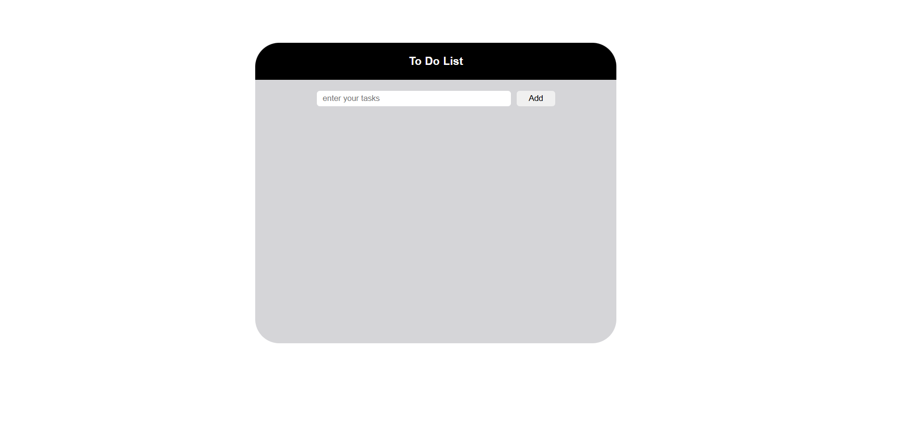

# 📝 To-Do List Application  

A simple and interactive **To-Do List Web Application** built with **HTML, CSS, and JavaScript**.  
It allows you to add, edit, mark as complete, and delete tasks with a clean UI.  

---

## 🚀 Features
- ✅ Add new tasks  
- ✏️ Edit tasks inline  
- ❌ Delete tasks  
- ✔️ Mark tasks as complete (with strikethrough effect)  
- 🔄 Cancel or confirm edits  
- ⌨️ Add tasks using the Enter key  
- 🎨 Clean and responsive UI  

---

## 🛠️ Tech Stack
- **HTML5** – Structure  
- **CSS3** – Styling (modular with `base.css` & `style.css`)  
- **JavaScript (DOM)** – Functionality  
- **Font Awesome** – Icons  

---

## 📂 Project Structure

---

## ▶️ Demo  

### 📸 Screenshot  
  

### 🎥 Video Walkthrough  
[Watch Demo Video](demo/video.mp4)  

---

## ⚡ Getting Started  

1. **Clone the Repository**  
   ```bash
   git clone https://github.com/mohamedathif-web/To-Do-List.git
